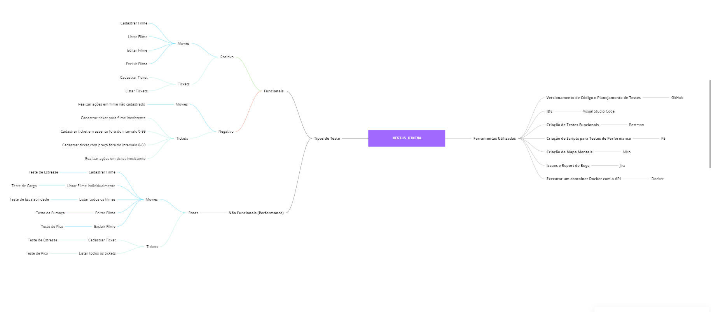

# Sobre Mim

Meu nome é Rodrigo,tenho 19 anos e moro em Vila Lângaro, uma pequena cidade do estado do Rio Grande do Sul. Estou cursando Ciência da Computação na Universidade de Passo Fundo, onde iniciei o terceiro semestre há alguns dias. Minha cor de pele é branca, meu cabelo é loiro e meus olhos são azuis.

# Menções

# Planejamento de Testes

## Nome do Projeto

Projeto Final PB Compass UOL

## Resumo

Projeto da Challenge Final (Sprint 8) do Programa de Bolsas da Compass UOL. Nele serão feitos alguns testes funcionais e serão priorizados testes de perfomances (foco do PB) na API NestJS Cinema https://github.com/juniorschmitz/nestjs-cinema, rodando localmente, no Docker e no EC2 AWS.

## Funcionalidades ou Módulos a serem testados

- Listagem de filmes;  
- Cadastrar novos filmes;  
- Atualizar um filme;  
- Excluir um filme;  
- Criar Ticket;  
- Listar os tickets;  
- Atualizar um ticket;  
- Excluir ticket.  

## Local de Testes

Será utilizada a API NestJS Cinema https://github.com/juniorschmitz/nestjs-cinema, rodando localmente. Além disso, serão usadas  e ferramentas como  Postman,Newman,Miro,GitHub,Jira,Visual Studio Code,Docker e K6.

# Recursos Necessários

- Conexão estável à internet;  
- Docker;  
- Swagger da API;  
- Restante das ferramentas citadas no segmento anterior.  

## Critérios Utilizados 

**DoR**

- Os recursos necessários estarem todos disponíveis e funcionando corretamente;
- Critérios de Aceitação (Acceptance Criteria) definidos;
- A ferramenta de testes (K6) deve estar instalada  ;

**DoD**

- Todos os testes planejados foram executados;  
- Nenhum bug crítico ou bloqueante permanece aberto;  
- Análise de Testes cobrindo as rotas Movies e Tickets;  
- Testes Não Funcionais realizados;  

**Acceptance Criteria**

- CRUD de Cadastro de Filmes implementado (CRIAR,LISTAR,EDITAR E DELETAR);
- Os filmes deverão possuir os campos TITLE, DESCRIPTION, LAUNCHDATE e SHOWTIMES;
- Não deverá ser possível listar, editar ou excluir um filme não cadastrado (inexistente);  
- CRUD de Cadastro de Tickets implementado (CRIAR,LISTAR,EDITAR E DELETAR);  
- Os tickets deverão possuir os campos MOVIEID, USERID, SEATNUMBER,PRICE,SHOWTIME;
- Não deverá ser possível cadastrar um ticket para um filme não cadastrado;
- Não deverá ser possível cadastrar um ticket com um assento fora do intervalo entre 0-99;
- Não deverá ser possível cadastrar um ticket com preço fora do intervalo entre 0-60;  
- Não deverá ser possível listar,editar ou excluir um ticket não cadastrado (inexistente);

## Riscos  
- Falhas no servidor da API;  
- Quedas de Conexão;
- Problemas no ambiente de teste;  
- Documentação com problemas.

## Cronograma 
O cronograma a ser seguido é o cronograma da sprint 08 (Início dia 24/02/2025 e término dia 12/03/2025).  

## Como os Resultados dos Testes Serão Divulgados
Eles serão registrados no GitHub, e apresentados na Challenge do dia 12/03/25,em um tempo  total de 6 minutos.

# Mapas Mentais

## Mapa Mental de Planejamento de Testes

Desenvolvi este mapa mental com foco no planejamento dos testes para a sprint. Ele também está disponível no diretório [MindMaps](MindMaps).



# Testes Candidatos a Automação

- Criação de Filmes;  
- Editar Filmes;  
- Procurar Filme por id;  
- Excluir Filmes;  
- Criar Ticket;  
- Procurar Ticket por id;  
- Editar ticket;  
- Excluir Ticket;  

# Resultados dos Testes Funcionais

Os resultados dos **Testes Funcionais de Caminho Feliz** foram publicados no [**Jira**](https://rodrigorigo.atlassian.net/plugins/servlet/ac/com.soldevelo.apps.test_management/test-cycles?board.id=1&project.key=SCRUM&project.id=10000&board.type=simple). Nele, estão contidos breves explicações sobre o que foi testado, prints, além de resultado (**"Passed"** ou **"Failed"**). Aqui no GitHub, irei adicionar alguns testes funcionais de caminho negativo que fiz para verificar a exeistência de algum bug.

### Post Movies

Ao cadastrar um filme com **data de exibição anterior a data de lançamento** do filme ,a API aceita sem contestações.


Ao cadastrar um filme sem **título ou descrição**, a requisição retorna com erro.


### Get Movies

Ao enviar uma requisição **GET com id inexistente**, a API retorna erro.


### Put Movies

Ao enviar uma requisição **PUT com algum erro no body, ou então com id inexistente**, a requisição falhará e retornará erro.


### Delete Movies

Ao tentar **excluir um usuário que não existe**, a requisição falhará,e retornará com mensagem de erro


# Planejamento de Testes de Performance

Para fins de testar a API de modo não funcional, será usado a ferramenta **K6** (link da documentação [aqui](https://grafana.com/docs/k6/latest/))

## Ferramentas Utilizadas

- Visual Studio Code;
- K6;  
- Prompt de Comando;  
- GitHub;

## 📌 Guia de Instalação e Execução do k6

### 🔹 O que é o k6?
k6 é uma ferramenta de testes de carga e desempenho para APIs e aplicações web. Ele permite simular múltiplos usuários acessando um sistema ao mesmo tempo.

---

### 📥 Instalação

### 🔹 Windows (usando Chocolatey)
Se você ainda não tem o **Chocolatey**, instale-o primeiro seguindo as instruções em [https://chocolatey.org/install](https://chocolatey.org/install).

Depois, execute o seguinte comando no **Prompt de Comando (cmd) como administrador**:
```sh
choco install k6
```

### 🔹 Linux (Ubuntu/Debian)
Execute os seguintes comandos:
```sh
sudo gpg -k || sudo apt install gnupg
curl -fsSL https://dl.k6.io/key.gpg | sudo gpg --dearmor -o /etc/apt/trusted.gpg.d/k6.gpg
echo "deb https://dl.k6.io/deb stable main" | sudo tee /etc/apt/sources.list.d/k6.list
sudo apt update && sudo apt install k6
```

### 🔹 macOS (usando Homebrew)
Se você usa **Homebrew**, basta executar:
```sh
brew install k6
```

### 🔹 Verificando a instalação
Após a instalação, execute o comando abaixo para verificar se o k6 foi instalado corretamente:
```sh
k6 version
```
Se tudo estiver certo, você verá a versão do k6 instalada.

---

## 🚀 Como Executar um Teste com k6

### 🔹 Criando um Script de Teste
Crie um arquivo `teste.js` com o seguinte conteúdo:
```javascript
import http from 'k6/http';
import { check, sleep } from 'k6';

export const options = {
  vus: 10, // 10 usuários virtuais
  duration: '30s', // Duração do teste
};

export default function () {
  let res = http.get('https://test-api.k6.io/public/crocodiles/');
  check(res, {
    'status é 200': (r) => r.status === 200,
  });
  sleep(1);
}
```

### 🔹 Executando o Teste
Agora, execute o teste com o comando:
```sh
k6 run teste.js
```
O k6 começará a simular **10 usuários virtuais (VUs) por 30 segundos**.

---

## 📊 Analisando os Resultados
Durante a execução, o k6 exibirá estatísticas como:
- **taxa de requisições**
- **tempo de resposta**
- **quantidade de erros**

Saída esperada no terminal:
```
checks................: 100.00% ✓ 10 ✗ 0  
http_req_duration....: avg=250ms min=180ms max=500ms
http_reqs............: 500 requests
vus..................: 10  
```
Isso permite avaliar o desempenho da API sob carga.

---

## 🔧 Recursos Adicionais
- [Documentação Oficial do k6](https://k6.io/docs/)
- [Repositório GitHub](https://github.com/grafana/k6)
)

**Agora está tudo pronto para executar os testes de desempenho com o K6! 🚀**

Bom, agora indo para o planejamento propriamente dito...

## Movies

### Cadastrar Filme

**Critérios de Aceitação**

- A API deve ser capaz de processar pelo menos 100 solicitações de criação de filmes por segundo;  
- O tempo médio de resposta para a criação de um novo filme não deve exceder 200 milissegundos.  

**Tipo de Teste**

Será executado o **Teste de Estresse**, com uma carga de 130 usuários. O teste durará 2 minutos.

### Listar todos os filmes

**Critérios de Aceitação**

- A API deve ser capaz de responder a solicitações GET de listagem de filmes em menos de 100 milissegundos;  
- A lista de filmes deve ser paginada, com no máximo 20 filmes por página.  

**Tipo de Teste**

Será executado o **Teste de Escalabilidade**, com uma carga máxima de 50 usuários. O teste durará 4 minutos.


### Listar Filmes Individualmente por id

**Critérios de Aceitação**

- A API deve ser capaz de responder a solicitações GET de detalhes de um filme em menos de 50 milissegundos.  

**Tipo de Teste**

Será executado o **Teste de Pico**, com uma carga de 100 usuários. O teste durará 2 minutos.


### Editar Filme

**Critérios de Aceitação**

- A API deve ser capaz de processar pelo menos 50 solicitações de atualização de filmes por segundo;  
- O tempo médio de resposta para a atualização dos detalhes de um filme não deve exceder 300 milissegundos. 

**Tipo de Teste**

Será executado o **Teste da Fumaça**, com apenas 1 usuário. O teste durará 5 segundos.


### Excluir Filme

**Critérios de Aceitação**

- A API deve ser capaz de processar pelo menos 30 solicitações de exclusão de filmes por segundo;  
- O tempo médio de resposta para a exclusão de um filme não deve exceder 400 milissegundos.  

**Tipo de Teste**

Será executado o **Teste de Carga**, com uma carga de 50 usuários. O teste durará 2 minutos.


## Tickets

### Cadastrar Tickets

**Critérios de Aceitação**

- A API deve ser capaz de processar pelo menos 50 solicitações de reserva de ingressos por segundo;  
- O tempo médio de resposta para a reserva de um ingresso não deve exceder 300 milissegundos.  

**Tipo de Teste**

O teste a ser executado será o **Teste de Carga**, com uma quantidade de VUs entre 50 a 80. O teste terá duração de 3 minutos. 